# 🍯 Honey Shop

A full-featured e-commerce platform for selling honey, built with Laravel. Supports guest checkout, customer accounts with loyalty discounts, a role-based admin panel (admin/staff), product discounts, notifications, a contact/support inbox, a togglable comments & feedback system, a token-authenticated API, and full English/Arabic (RTL) localization.

## Screenshots

### Storefront

| Home Page | Product Page (with discount) | Cart |
|---|---|---|
| 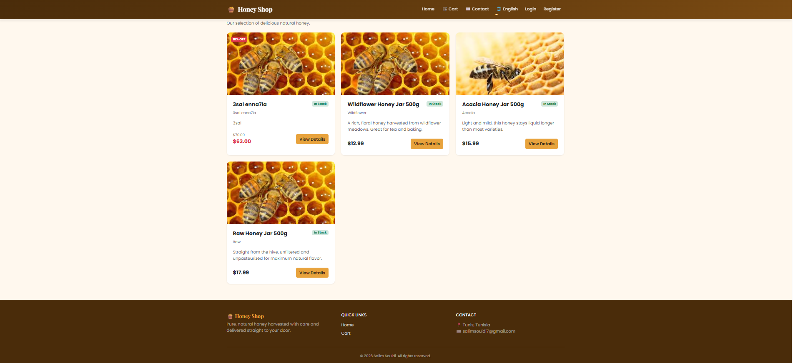 | 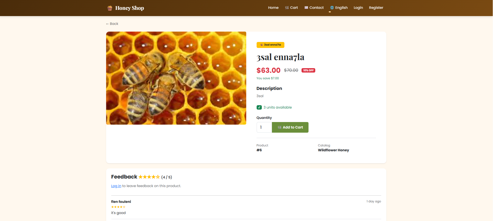 | 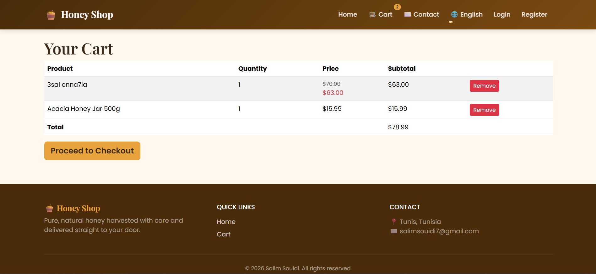 |

| Checkout | Order Confirmation |
|---|---|
| 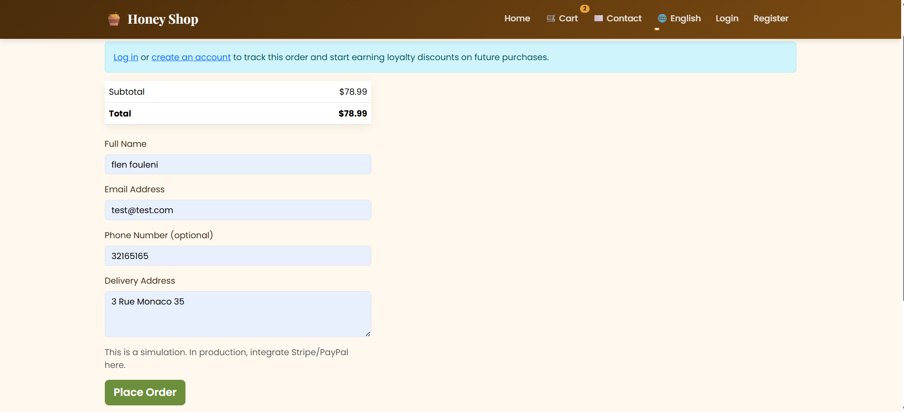 | 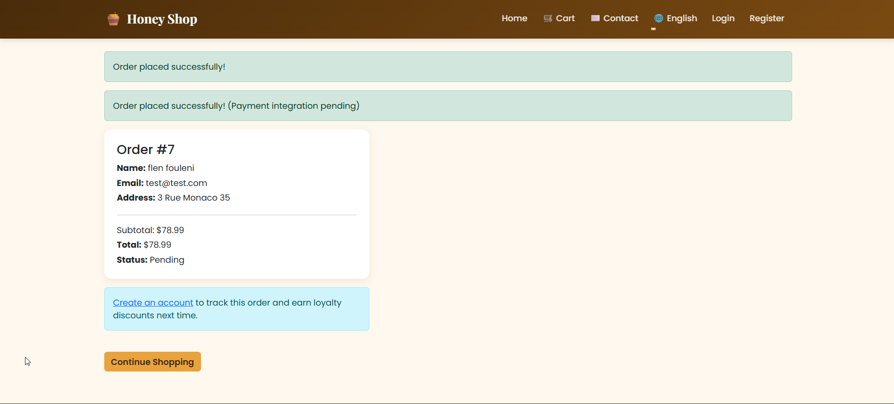 |

### Customer Account

| Login | My Orders (loyalty discount) |
|---|---|
| 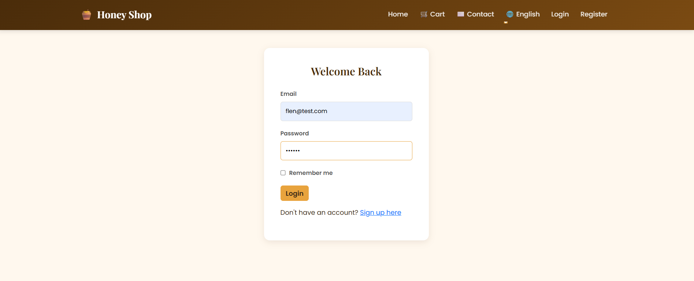 | 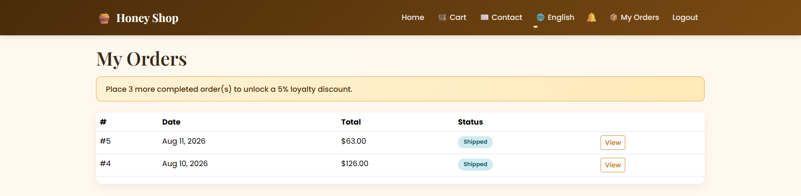 |

### Admin Panel

| Dashboard | Products | Orders |
|---|---|---|
| 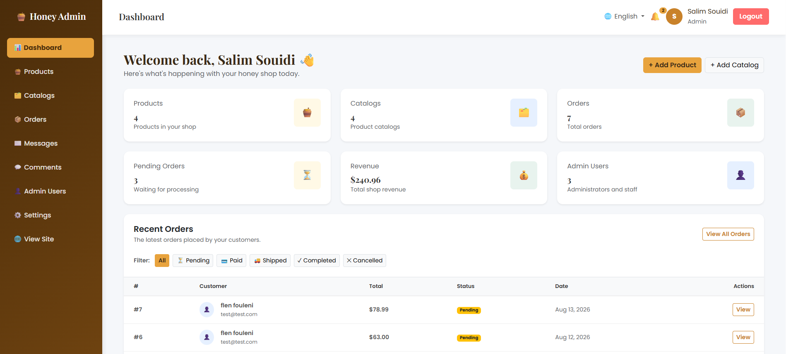 | 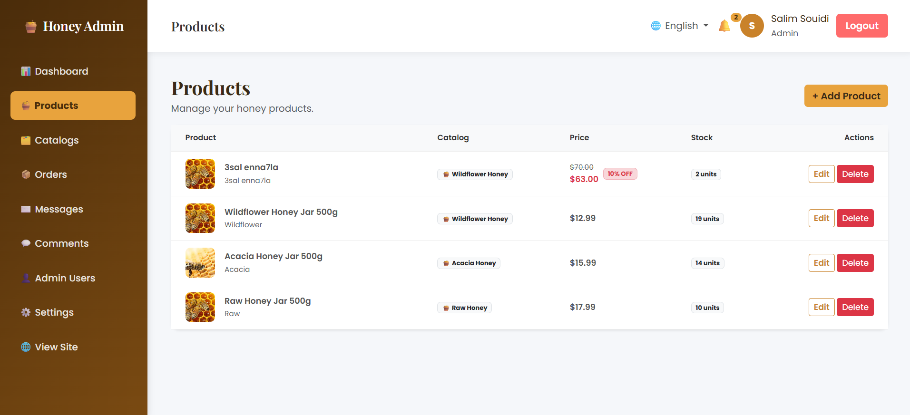 | 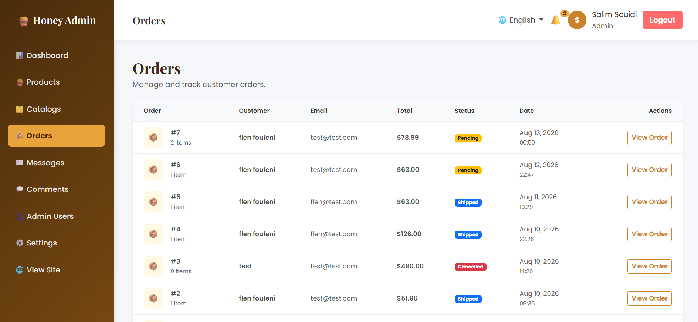 |

| Order Detail & Status Update | Feature Settings (license toggle) |
|---|---|
| 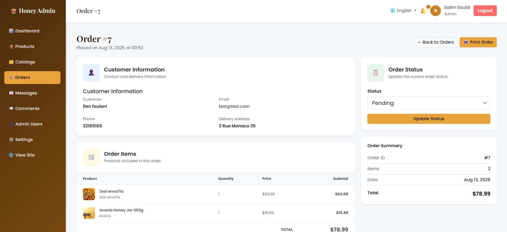 | 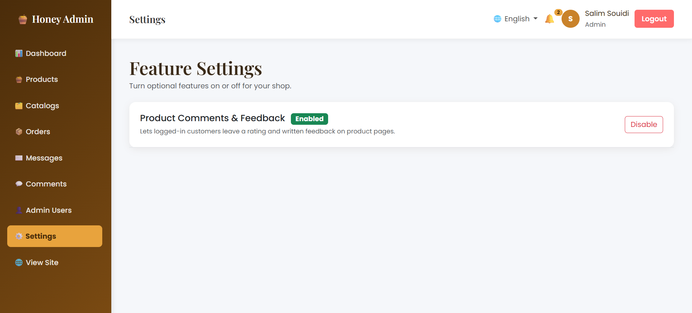 |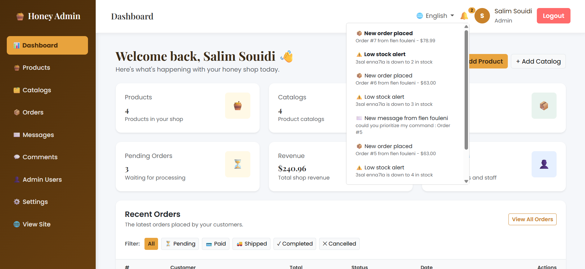 |

### Arabic (RTL) Support

| Home Page (Arabic) | Admin Dashboard (Arabic) |
|---|---|
| 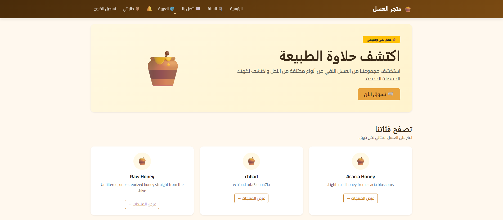 | 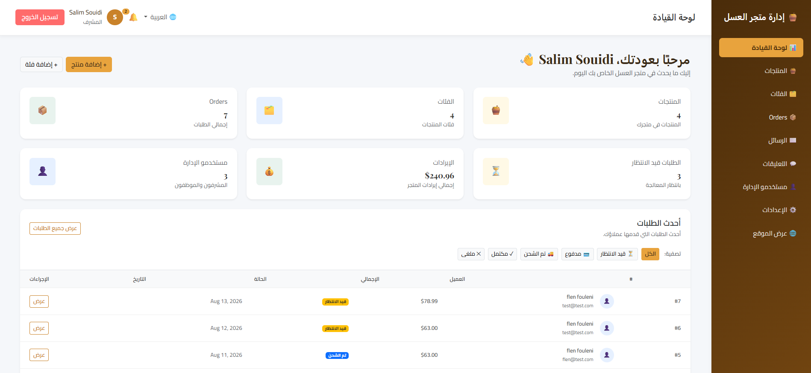 |

## Features

- **Storefront** — browse catalogs, view products, cart, guest or logged-in checkout
- **Customer accounts** — order history, loyalty discount tiers (5% after 3 completed orders, 10% after 6)
- **Admin panel** with two roles:
  - **Admin** — full access, including deleting products/catalogs and managing other admin/staff accounts
  - **Staff** — can manage products, catalogs, orders, and messages, but cannot delete or manage users
- **Product discounts** — percentage or fixed-amount, set per product
- **Notifications** — in-app bell icon for order updates, new orders, low stock alerts, and new messages
- **Contact & messages** — customers can contact the shop; admin/staff reply from the inbox
- **Comments & Feedback** — an optional feature customers can rate/comment on products, toggled on/off from **Admin → Settings** (built as a foundation for a future license-key system)
- **REST API** — token-based authentication (Laravel Sanctum) for a future mobile app
- **Multi-language** — English and Arabic, with automatic right-to-left layout for Arabic

## Tech Stack

- **Backend:** PHP 8.2+, Laravel 11
- **Database:** MySQL
- **Frontend:** Blade templates, Bootstrap 5 (via CDN — no npm/build step required)
- **Auth:** Laravel's built-in session auth (web) + Laravel Sanctum (API)

---

## Prerequisites

Install these before you start:

| Tool | Purpose | Link |
|---|---|---|
| **XAMPP** | Local Apache + MySQL + PHP environment | [apachefriends.org](https://www.apachefriends.org/download.html) |
| **Composer** | PHP dependency manager | [getcomposer.org](https://getcomposer.org/download/) |
| **Git** | Version control | [git-scm.com](https://git-scm.com/downloads) |

> **Note:** This project loads Bootstrap and Google Fonts via CDN, so **Node.js/npm is not required** to run it.

Verify installs by running in a terminal:
```bash
php -v        # should show PHP 8.2 or higher
composer -V
git --version
```

---

## 1. Clone the repository

Navigate into your XAMPP `htdocs` folder first, then clone:

```bash
cd C:\xampp\htdocs
git clone https://github.com/salimessouidi7/honey_shop.git
cd honey_shop
```

## 2. Install PHP dependencies

```bash
composer install
```

## 3. Set up your environment file

Copy the example environment file:

```bash
copy .env.example .env
```
*(On Mac/Linux, use `cp .env.example .env` instead.)*

Generate the application encryption key:

```bash
php artisan key:generate
```

## 4. Create the database

1. Start **Apache** and **MySQL** from the XAMPP Control Panel.
2. Open [http://localhost/phpmyadmin](http://localhost/phpmyadmin).
3. Click **New**, name the database `honey_shop_db`, and click **Create**.

If you used a different database name, update `DB_DATABASE` in your `.env` file to match.

## 5. Run migrations and seed initial data

```bash
php artisan migrate
php artisan db:seed --class=AdminUserSeeder
php artisan db:seed --class=FeatureSeeder
```

Optional — sample honey products/catalogs to browse right away:

```bash
php artisan db:seed --class=HoneyShopSeeder
```

## 6. Install the API (Sanctum)

The project includes a token-authenticated API. Set it up with:

```bash
php artisan install:api
php artisan migrate
```

> This also registers `routes/api.php` in `bootstrap/app.php` automatically. If you get a 404 on any `/api/...` route afterward, open `bootstrap/app.php` and confirm `api: __DIR__.'/../routes/api.php'` appears inside the `withRouting()` call.

## 7. Visit the site

Since this runs through XAMPP's Apache (not `php artisan serve`), the project is accessible at:

```
http://localhost/honey_shop/public
```

**Default login credentials** (from the seeder):

| Role | Email | Password |
|---|---|---|
| Admin | `admin@honeyshop.test` | `password` |
| Staff | `staff@honeyshop.test` | `password` |

Admin panel: `http://localhost/honey_shop/public/admin/login`

> ⚠️ **Change these passwords** (or create new admin users and delete the seeded ones) before deploying this anywhere beyond your local machine.

---

## Project Structure Notes

A few things that aren't obvious from a typical Laravel project, in case you're picking this up fresh:

- **Custom middleware aliases** (`role`, `feature`) are registered in `bootstrap/app.php`. If routes protected by `role:admin` or `feature:comments` throw a "Target class does not exist" error, this file is the first place to check.
- **Feature toggles** live in the `features` database table (managed via **Admin → Settings**). The `comments` feature ships **disabled by default** — enable it from Settings to see the product feedback UI.
- **Guest checkout works without an account.** Customer accounts are optional and unlock order history + loyalty discounts, but are never required to buy.
- **Language files** live in `resources/lang/ar.json` (English needs no file — untranslated strings just display as-is, since English is the fallback).

## Troubleshooting

**"Target class [role] does not exist" or similar for `feature`:**
The middleware alias is missing from `bootstrap/app.php`. It should contain:
```php
->withMiddleware(function (Middleware $middleware) {
    $middleware->alias([
        'role' => \App\Http\Middleware\CheckRole::class,
        'feature' => \App\Http\Middleware\CheckFeature::class,
    ]);
})
```

**Database connection errors on `php artisan migrate`:**
Double-check `DB_DATABASE`, `DB_USERNAME`, and `DB_PASSWORD` in `.env` match your actual MySQL setup, and that the database itself already exists (Laravel doesn't create it for you).

**CSS/styling looks broken or outdated after a pull:**
Hard-refresh your browser (`Ctrl+Shift+R` / `Cmd+Shift+R`) — browsers aggressively cache `.css` files.

**API routes return a styled 404 page:**
`routes/api.php` isn't registered. Re-run `php artisan install:api`, or manually add the `api:` line to `withRouting()` in `bootstrap/app.php` as shown above.

---

## Taking Screenshots

When you're ready to fill in the placeholders above:

1. Create the folder: `docs/screenshots/` in your project root.
2. Capture each page listed in the table above and save it with the **exact filename** shown (e.g. `home.png`, `admin-dashboard.png`) — the README already links to these paths, so matching names means no further edits needed.
3. A few tips for consistent, professional-looking screenshots:
   - Use a consistent browser window size (e.g. 1440×900) for all desktop shots so the gallery looks uniform.
   - Populate the shop with a few real-looking products first (use `HoneyShopSeeder`, or add 4-5 products with real image URLs) — empty tables and placeholder images make screenshots look unfinished.
   - For the **admin** shots, log in as the `admin` account so all sidebar links (Users, Settings) are visible.
   - For the **discount** product screenshot, make sure at least one product has a discount set (Admin → Products → Edit → Discount) so the struck-through price and badge are visible.
   - For the **loyalty discount** shot on "My Orders," you'll need a customer account with at least 3 completed orders — mark a few test orders as `completed` from the admin panel first.
   - For the **Arabic** shots, switch the language via the 🌐 dropdown before capturing — check that the RTL layout and Cairo font are rendering correctly.
   - Crop out browser chrome (tabs, bookmarks bar) if possible — a full-page screenshot tool or browser extension (like "GoFullPage" or your browser's built-in screenshot tool) gives cleaner results than a raw window capture.
4. Commit the images along with your next push:
   ```bash
   git add docs/screenshots/
   git commit -m "Add project screenshots"
   git push
   ```

## License

This project is for personal/educational use. Add a license of your choice here (MIT is a common permissive option) if you plan to distribute or open-source it.
